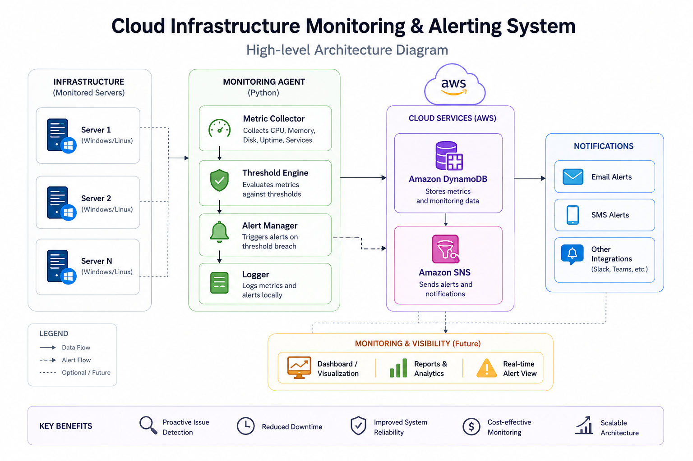

# Cloud Infrastructure Monitoring & Alerting System

A Python-based infrastructure monitoring and alerting application designed to simulate a real-world cloud operations monitoring workflow.

The project periodically collects system health metrics, monitors critical services, performs threshold-based checks, and logs monitoring events. It is being developed as a practical learning project to gain hands-on experience in Cloud Computing, Linux Administration, DevOps, Infrastructure Monitoring, and AWS.

---

## Business Problem

In production environments, infrastructure issues such as:

- High CPU utilization
- Memory exhaustion
- Disk space shortages
- Critical service failures

can lead to application outages, operational downtime, and poor user experience.

This project aims to proactively detect infrastructure issues through automated monitoring and alerting workflows, helping improve incident response and operational reliability.

---

## Project Objectives

- Monitor server health metrics automatically.
- Detect abnormal resource utilization.
- Monitor critical service availability.
- Generate threshold-based alerts.
- Log monitoring events for troubleshooting.
- Build a scalable foundation for cloud monitoring solutions.

---

## Current Features (Implemented)

✅ CPU utilization monitoring

✅ Memory utilization monitoring

✅ Disk utilization monitoring

✅ System uptime monitoring

✅ Service status monitoring

✅ Threshold-based alert detection

✅ File-based logging

✅ Structured metrics modeling

---

## Planned Features

⬜ AWS DynamoDB integration

⬜ AWS SNS email notifications

⬜ AWS EC2 deployment

⬜ Cron-based scheduling

⬜ Docker containerization

⬜ Multi-server monitoring

⬜ Dashboard visualization

⬜ AWS CloudWatch integration

---

## Technologies Used

| Technology | Purpose |
|------------|---------|
| Python | Application logic |
| psutil | System metric collection |
| Git | Version control |
| GitHub | Project hosting |
| Linux Concepts | Infrastructure monitoring |
| AWS (Planned) | Cloud services |
| Docker (Planned) | Containerization |

---

## Current Architecture

## Architecture Diagram v1



### Development Environment

```text
Windows Machine
        |
        v
Python Monitoring Agent
        |
        v
Metric Collector
        |
        v
Threshold Checker
        |
        v
Logger
```

---

## Planned Production Architecture

```text
Linux Server / AWS EC2
            |
            v
Python Monitoring Agent
            |
            v
Metric Collection
            |
            v
Threshold Engine
            |
            +------------+
            |            |
            v            v
        DynamoDB      SNS Alerts
```

---

## Project Structure

```text
cloud-infrastructure-monitor/

│
├── monitoring/
│   ├── collector.py
│   ├── service_checker.py
│   ├── threshold.py
│   ├── logger.py
│   └── __init__.py
│
├── models/
│   ├── metrics.py
│   └── __init__.py
│
├── aws/
│   ├── dynamodb.py
│   ├── sns.py
│   ├── ec2_metadata.py
│   └── __init__.py
│
├── config/
│   └── config.py
│
├── logs/
│
├── architecture/
│
├── screenshots/
│
├── tests/
│
├── main.py
├── requirements.txt
├── README.md
└── .gitignore
```

> **Note:** `ec2_metadata.py` is reserved for the future AWS EC2 deployment phase and will be used to retrieve EC2 instance metadata during cloud deployment.

---

## Sample Output

### Development Environment (Windows)

```text
SystemMetrics(
    server_id='local-machine',
    timestamp='2026-06-14T00:05:48',
    cpu_usage=44.5,
    memory_usage=90.0,
    disk_usage=38.0,
    uptime='1 days, 7 hours, 16 minutes',
    service_status={
        'service': 'python.exe',
        'status': 'Running'
    }
)
```

### Example Threshold Alert

```text
Memory usage exceeded threshold: 90.0%
```

> **Note:** This example was generated from the local Windows development environment. During production deployment on AWS EC2 (Linux), the monitoring agent will monitor Linux services such as `sshd`, `cron`, `nginx`, or application-specific services.

---

## Installation

Clone the repository:

```bash
git clone https://github.com/neha18-dp/cloud-infrastructure-monitor.git

cd cloud-infrastructure-monitor
```

Create a virtual environment:

```bash
python -m venv venv
```

Activate the environment:

### Windows

```bash
venv\Scripts\activate
```

### Linux

```bash
source venv/bin/activate
```

Install dependencies:

```bash
pip install -r requirements.txt
```

Run the application:

```bash
python main.py
```

---

## Learning Outcomes

This project helps develop practical experience in:

- Python scripting
- Infrastructure monitoring
- Linux administration concepts
- System troubleshooting
- Logging and alerting
- Cloud operations
- AWS services
- DevOps workflows
- Version control
- Technical documentation

---

## Future Enhancements

- Deploy to AWS EC2
- Integrate AWS DynamoDB
- Configure AWS SNS alerts
- Add cron scheduling
- Dockerize the application
- Implement multi-server monitoring
- Build a dashboard
- Integrate AWS CloudWatch

---

## Author

**Neha Dnyaneshwar Patil**

Aspiring Cloud Support & Infrastructure Engineer

- LinkedIn: https://linkedin.com/in/nehadpatil
- GitHub: https://github.com/neha18-dp